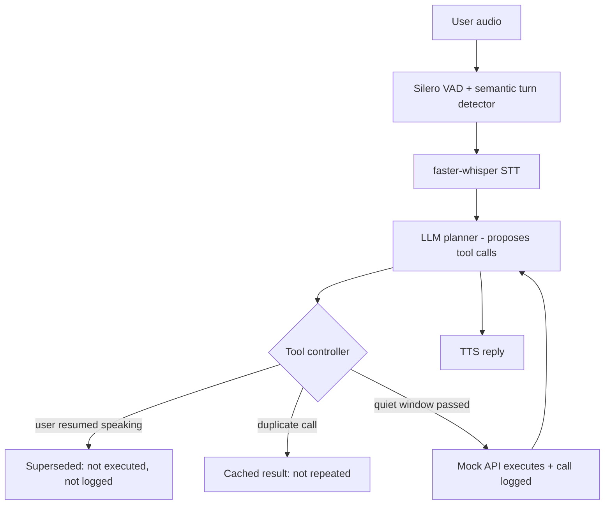

# Interruptible Voice Agents: When Timing Matters

**Samsung PRISM GenAI Hackathon, 3rd Edition 2026–27 — Theme 05: Interruptible Real-Time Agents**
**Team Knox**

| Member | Email |
|---|---|
| Aiyana Sehgal | aiyanasehgal2123@gmail.com · as6671@srmist.edu.in |
| Srinjoyee Acharyya | srinjoyee.acharyya@gmail.com · sa3661@srmist.edu.in |
| Simran Das | mailme.simrandas@gmail.com · sd2394@srmist.edu.in |

📹 **Demo video (3–5 min):** https://youtu.be/yLMXs2C_6Kc
📊 **Presentation:** [`docs/Interruptible-Voice-Agents.pptx`](docs/Interruptible-Voice-Agents.pptx)
🏷️ **Tag:** `PRISM_GENAI_HACKATHON_Y2026`
🤖 **AI disclosure:** [`AI_DISCLOSURE.md`](AI_DISCLOSURE.md)

---

A LiveKit voice agent for Full-Duplex-Bench v3. The LLM only *proposes* tool calls; a small
coordination layer (`agent/controller.py`) decides whether each call actually runs. This stops the
agent from acting on half-finished or self-corrected sentences, and from repeating actions.

**Headline result:** on the disfluency category the FDB-v3 paper identifies as the cascaded
architecture's worst failure mode — self-correction, where the published cascaded baseline scores
**0.176, the lowest of any system tested** — this agent scores **0.471**, using a free local 7B
model instead of GPT-4o.

**Provider declaration:** every model runs **locally on the evaluating machine**. No paid API and
no model-provider account is used at evaluation time.

| Stage | Model | Runs on |
|---|---|---|
| VAD | Silero | CPU |
| Turn detection | LiveKit English turn detector | CPU |
| STT | faster-whisper (`medium.en` on GPU; `small.en` CPU fallback) | GPU if CUDA is usable, else CPU int8 |
| LLM | `qwen2.5:7b-instruct` via Ollama, an OpenAI-compatible local server | GPU if available, else CPU |
| TTS | Piper (`en_US-amy-medium`) | CPU |

The only credentials needed are **LiveKit Cloud** (free tier), because the benchmark harness drives
the agent over a LiveKit room. `reproduce.sh` downloads and starts the local LLM server itself — no
sudo, no system install, nothing outside the project directory.

## Architecture



The controller enforces three rules:

1. **Commit gate.** A call runs only once the user has been silent for a quiet window (default
   0.9 s, measured from the end of their speech, so LLM thinking time overlaps it). If they speak
   again, or LiveKit interrupts the reply, the call is dropped before execution.
2. **Idempotency.** Identical calls (same tool, normalized arguments) run once per session.
3. **In-flight dedup.** Concurrent identical proposals share one execution.

Why every tool is gated, including read-only ones: in FDB-v3's strict pass rate, any extra call fails
the scenario, so a stale "search Paris" before "actually, Berlin" is as costly as a stale booking.

Other decisions:
- The harness disconnects about 1.5 s after the audio ends; the session is kept alive
  (`close_on_disconnect=False`) so calls still inside the gate can finish and be logged.
- Mock tool latency uses `time.sleep`; execution runs in a thread so the event loop keeps
  handling speech events.
- Tool names, signatures and descriptions are identical to the benchmark's cascaded template
  (verified against `v3/cascaded_agent.py` at the pinned commit). No benchmark items are hardcoded;
  prompt rules are general (corrections, spelled IDs, no invented details).
- LiveKit plugins are imported at module scope so `download-files` fetches their weights — a lazy
  import leaves the turn detector without its model and every job crashes.

## Results

100 scenarios, FDB-v3 at commit `3e799c45a045256f47d5f1c9cda90157e2d2ec9e`.
Full reports, tool-call log and controller trace are in [`results/`](results/).

### Against the published baseline

Baseline figures are the **Cascaded** row of Table 2/3/4 in the FDB-v3 paper
([arXiv:2604.04847](https://arxiv.org/abs/2604.04847)), a Whisper → GPT-4o → TTS pipeline.

| Metric | Cascaded baseline (published) | **This agent** |
|---|---|---|
| Tool selection accuracy | 0.803 | **0.895** |
| Argument accuracy | 0.562 | 0.418 |
| **Pass@1 — strict** | **0.450** | 0.290 exact-match · 0.500 local judge |
| Turn-take rate | 100.0% | 94.0% |
| Task completion latency | 10.12 s | **5.12 s** |
| Interruption rate | 33.0% | **4.3%** |

### Robustness to disfluency (Pass@1 per category)

The paper's Table 3. The baseline column is the published Cascaded row.

| Disfluency | Cascaded (published) | **This agent** |
|---|---|---|
| **Self-correction** | **0.176** (lowest of all systems tested) | **0.471** |
| False start | 0.500 | 0.333 |
| Hesitation | 0.600 | 0.300 |
| Pause | 0.444 | 0.278 |
| Filler | 0.448 | 0.172 |

Self-correction is the category this architecture exists to fix, and it is the one where it most
clearly beats the baseline — **2.7×**, with a 7B local model rather than GPT-4o. For reference, the
published self-correction scores for the hosted end-to-end systems are GPT-Realtime 0.588,
Gemini Live 2.5 0.471, Gemini Live 3.1 0.353, Ultravox 0.353, Grok 0.294.

The same effect appears in the state-rollback split, which is not in the paper:

| | Pass@1 |
|---|---|
| Scenarios **with** state rollback | **0.471** |
| Scenarios without rollback | 0.253 |

The agent is *better on the harder subset* — the inverse of the usual pattern, and direct evidence
that the gate is doing the work rather than the model.

### What the controller actually did

From `results/fdb_controller_trace.log` over the 100 scenarios:

| Decision | Count |
|---|---|
| `executed` | 128 (85.3%) |
| `superseded` (user resumed speaking) | 18 (12.0%) |
| `dedup` (identical call already made) | 4 (2.7%) |

**22 calls were blocked before reaching the tool log.** Under FDB-v3's strict rule, any extra call
fails the scenario outright, so each of those would have been an automatic failure.

### Read these numbers honestly

- **The Pass@1 columns are not directly comparable.** Official FDB-v3 evaluation uses a hosted
  `gpt-4o` judge, which costs money and so is not used here. The **0.290** figure is the benchmark's
  deterministic exact-match scoring — *stricter* than the official judge. The **0.500** figure is the
  benchmark's `--use-llm` judge pointed at the local 7B model, which is indicative only. The true
  gpt-4o-judged score is most likely between the two, but it has not been measured.
- The 21-point gap between those two figures is almost entirely **argument formatting**: the judge
  accepts `savings_account` ≈ `savings` and `2023-10-07` ≈ `October 7`; exact-match does not.
- The baseline uses **GPT-4o**; this agent uses a **7B model that runs on a free GPU**. The
  comparison favours the baseline on raw model capability and the gate on robustness.
- Two scenarios (`housing_05`, `housing_14`) expect a `pets_allowed` argument that does not exist in
  the official `search_apartments` signature (`city, bedrooms, max_price` — see
  `v3/cascaded_agent.py:208`). They are unreachable for any agent using the official schema, so the
  effective ceiling is 98/100.

### Configuration that produced these numbers

`FDB_QUIET_WINDOW=0.9`, `FDB_MIN_EP=0.6`, `FDB_MAX_EP=2.0`, `FDB_KEEP_ALIVE=1`,
`FDB_TURN_DETECTOR=1`, `FDB_LLM_MODEL=qwen2.5:7b-instruct` (temperature 0),
`FDB_WHISPER_MODEL=medium.en`, `FDB_WHISPER_DEVICE=cuda`, `FDB_WHISPER_COMPUTE=float16`.

Hardware: NVIDIA T4 (16 GB), Python 3.10. See [`results/runs.md`](results/runs.md) for the run log.

### Hardware sensitivity (a real finding)

The same code, model and prompt scored **0.022** on an 8 GB laptop GPU and **0.290** on a 16 GB T4.
The cause was not the agent: on 8 GB the LLM crowds Whisper onto the CPU, response latency rises to
6.49 s, and the harness's 1.5 s disconnect window is missed — turn-take rate collapses from 0.94 to
0.28. **This benchmark is highly sensitive to end-to-end latency**, and a system that is
architecturally correct can still score near zero on insufficient hardware. Anyone reproducing this
should use a GPU with enough headroom for both models.

## Reproduce (one command)

Requirements: Linux or macOS (on Windows, use WSL2 Ubuntu 22.04), **Python 3.10** with the `venv`
module (`apt-get install python3-venv`), `ffmpeg`, `git`, `unzip`, `curl`, `zstd`, and a free LiveKit
Cloud project. **No model-provider API key is needed.** A CUDA GPU is optional but strongly
recommended — see hardware sensitivity above.

```bash
cp .env.example .env.local      # fill in LIVEKIT_URL, LIVEKIT_API_KEY, LIVEKIT_API_SECRET
./reproduce.sh
```

The script creates a venv, installs pinned dependencies, clones the benchmark at the pinned commit,
downloads the official data, fetches and starts the local LLM server (Ollama, unpacked into `work/`,
no sudo) and the Piper TTS voice, runs all 100 examples, then evaluates with exact-match scoring and
again with the local LLM judge. Reports land in `results/`.

First run downloads roughly 10 GB (PyTorch + CUDA wheels, the LLM server, the 7B model, the
benchmark data and the TTS voice). Later runs reuse all of it. Expect ~100 minutes on a T4.

**Tested on:** Ubuntu 22.04 / WSL2 (laptop, 8 GB RTX 4060) and a clean Kaggle Linux instance
(T4 16 GB, no pre-existing environment) — the latter is the closest analogue to a fresh judging
machine.

**Important:** only one agent worker per LiveKit project may run during evaluation; LiveKit
dispatches rooms to any registered worker, and tool calls are logged on the machine that ran them.

Offline tests (no keys needed): `python tests/test_controller.py && python tests/test_extension.py`

### Judge model note

FDB-v3's two evaluator scripts hardcode `model="gpt-4o"` for their LLM judge. `reproduce.sh` applies
a one-line, general patch so the judge model is read from `FDB_JUDGE_MODEL`, defaulting to the same
local model. No scoring logic is changed, and the report then records the model that actually judged
rather than claiming a model that was never called.

## ⭐ Extension use case: interruptible smart-home assistant

`extension/smart_home_agent.py`: a hands-free home assistant (AC, lights, door lock) using the same
controller. It adds **state-based idempotency**: if a device is already in the requested state the
tool reports `no_change` and does nothing, while a user can still legitimately repeat an action later.
Session-level dedup (right for the benchmark) would wrongly block that in a real home.

```bash
python extension/smart_home_agent.py download-files   # first time
python extension/smart_home_agent.py console          # talk through your microphone
```

Live home state is printed in the terminal after every change. Example: *"Set the AC to 22... no
wait, the bedroom one, and make it 24"* changes only the bedroom AC.

Why this is a genuine extension rather than a reskin: the benchmark's mock tools are stateless, so
session-level dedup is the correct policy there. Real devices hold state, where that policy is
actively wrong — "turn the lights back on" an hour later must work. The controller takes `dedupe`
as a parameter precisely so the idempotency policy can follow the domain.

## Limitations (honest)

- Latency trade-off: the commit gate adds delay when the LLM is faster than the quiet window.
- A pause longer than the quiet window, followed by a correction, can still let the first call run.
- **Argument accuracy (0.418) is the dominant failure**, not tool selection (0.895). Of the argument
  failures: 41% are genuine comprehension errors, 23% are dates reformatted or given an invented year
  (`2023-10-07` for "October 7"), 18% are verbosity (`savings_account` for `savings`), 10% are
  spelled-out IDs left punctuated (`D-L-5-5-5` for `DL555`). The last three are model-adherence
  problems a stronger LLM would largely avoid.
- **Multi-step chains degrade sharply**: Pass@1 is 0.394 for 1 tool, 0.111 for 2, 0.062 for 3. A 7B
  model stops after the first action instead of completing the chain.
- `travel_identity` scores 0.0 despite 0.937 tool selection in that domain — the agent picks the
  right tool every time and then writes the date in the wrong format.
- A local 7B model is weaker at function calling than a frontier hosted model. The commit gate is
  model-agnostic, so the architecture's contribution holds, but absolute scores are lower than the
  same design would reach on GPT-4o. `FDB_STACK=openai` runs that comparison if a key is supplied.
- Spoken replies are often cut off by the harness recording window, which affects response scoring
  for all systems.

## What I would do next

1. **Argument formatting is the cheapest win.** Dates, verbosity and spelled-out IDs account for
   ~51% of argument failures and are addressable with general prompt rules (use the user's own
   wording for dates; never add a year; join spelled letters into one token) — no benchmark-specific
   logic. On the failure counts, that is worth roughly 10–15 points of Pass@1.
2. **A stronger local model** (14B–32B on a larger GPU) should close most of the remaining argument
   and multi-step gap, since tool *selection* is already at 0.895.
3. **Prewarm models per job process.** LiveKit runs each job in its own subprocess, so Whisper and
   Piper reload per scenario; a prewarm hook would cut the 5.12 s mean latency further.
4. **Adaptive quiet window** — learn the pause length that distinguishes "thinking" from "finished"
   per speaker, rather than using one fixed 0.9 s for everyone.
